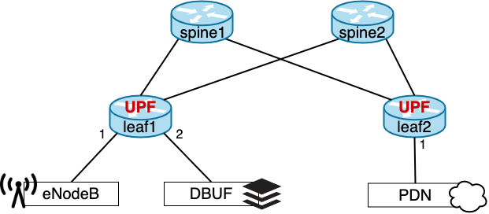
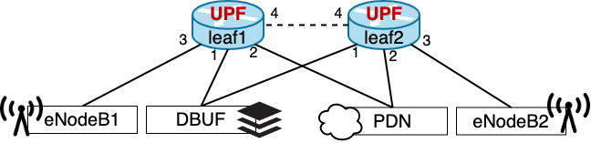

<!--
SPDX-FileCopyrightText: 2020 Open Networking Foundation <info@opennetworking.org>
SPDX-License-Identifier: LicenseRef-ONF-Member-1.0
-->

# Integration Test Scenarios

This directory contains test scenarios for the ONOS System Test Coordinator (STC) framework.

From <https://wiki.onosproject.org/x/oYe9>
> STC is a developer oriented framework for testing and debugging running ONOS clusters. It allows
> modular definition and composition of test scenarios, as well as reuse of test modules. Developers
> can use scenarios in a semi-automated or fully automated manner. STC tracks dependencies between
> scenarios and allows parallel execution of steps that don't depend on each other to improve
> performance and to allow modeling concurrent activities like running a step on each node in a
> cluster. Larger scenarios can be built up from smaller scenarios allowing reuse of tests.

We use STC to test the UP4 ONOS app in a Mininet-based emulated environment including:
* 2x2 fabric and paired leaves of `stratum_bmv2` switches
* Emulated eNodeB and Packet Data Network (PDN) hosts (regular Mininet hosts)
* DBUF service (running in a Mininet host)
* 3 ONOS instances
* 3 Atomix instances
* PFCP agent
* Mock SMF

Scenarios are defined using XML files contained in this directory.

To learn more about the STC framework:
* Developing your own STC test: https://wiki.onosproject.org/x/u4q9
* Reference: https://wiki.onosproject.org/x/ZIPM
* Advanced topics: https://wiki.onosproject.org/x/uYq9

# Requirements

To run test scenarios your system needs to meet the following requirements:

- 8GB RAM and 6 CPU cores (if using Docker for Mac check settings to modify resources)
- Java Runtime Environment 1.8 or higher (tested with
  [Zulu OpenJDK 11](https://www.azul.com/downloads/zulu-community/?architecture=x86-64-bit&package=jdk), but any JDK or JRE should do)
- Docker v19 or higher
- docker-compose
- make
- maven

## Quick steps

Download dependencies (do only once):

    make deps

Run the smoke scenario:

    make pfcp-smoke.xml

This scenario verifies UP4 app builds. It included a non-exhaustive set of tests that aim at
ensuring that the most important functions work. Some functions tested in this scenario are:
* UP4 app install and activation
* UP4 northbound APIs (via P4Runtime calls received either from the PFCP agent or a mock controller)
* Basic GTP termination for both uplink and downlink traffic
* Basic downlink buffering capabilities

Logs for each step executed in the scenario can be found in `tmp/stc`.

During the scenario execution you can access the STC web UI at <http://localhost:9999>. The UI shows
a graph of all the test steps and their dependencies.

## Specify a different topology

By default, all scenarios use the 2x2 leaf-spine topology. Other topologies
can be specified via the `TOPO` environment variable.

Currently, we support two topologies:
- 2x2 leaf-spine: `TOPO=leafspine`  

- single pair-leaf (note that PDN and DBUF are dual-homed): `TOPO=singlepair`  

## Scenarios

Some scenarios depend on others executing first. For example, all scenarios except for the smoke tests
 use the docker-compose topology launched by `setup.xml`. The dependencies for all scenarios are listed
in the descriptions below.
To execute a given scenario:

    make scenario.xml

### Setup and teardown scenarios
These scenarios are used for launching containers and network functions,
and for removing them after tests are completed.

**setup.xml**
* Start Docker containers for Mininet and ONOS
* Install local build of UP4 app
* Verify that all components have started correctly

**net-setup.xml**
* Requires `setup.xml`
* Push netcfg.json to ONOS
* Verify that all switches, links, and host are discovered successfully

**smf-setup.xml**
* Requires `setup.xml`, `net-setup.xml`
* Initialize a Mock SMF for communication with the PFCP agent

**smf-teardown.xml**
* Requires `setup.xml`, `net-setup.xml`, `smf-setup.xml`
* Stop the Mock SMF

**teardown.xml**
* Requires `setup.xml`
* Dump Docker container logs
* Stop containers

### Single test cases
These scenarios each test small subsets of features, such as forwarding, buffering, or failure recovery.
These scenarios do not perform setup or teardown, but they do clean up after themselves
and thus can be run repeatedly and consecutively.

**p4rt-forwarding.xml**
* Requires `setup.xml`, `net-setup.xml`
* Use UP4 northbound APIs to set up GTP termination and forwarding
* Check forwarding by sending and receiving traffic using the eNodeB and PDN Mininet hosts

**p4rt-forwarding-qos.xml**
* Requires `setup.xml`, `net-setup.xml`
* Use UP4 northbound APIs to set up GTP termination and forwarding with QFI
* Check forwarding by sending and receiving traffic using the eNodeB and PDN Mininet hosts with QFI

**p4rt-buffering.xml**
* Requires `setup.xml`, `net-setup.xml`
* Same as p4rt-forwarding.xml but checks the case where downlink buffering is enabled

**p4rt-end-marker.xml**
* Requires `setup.xml`, `net-setup.xml`
* Use UP4 packet-out API to send an End Marker packet
* Check eNodeB correctly receives the packet

**pfcp-forwarding.xml**
* Requires `setup.xml`, `net-setup.xml`, `smf-setup.xml`
* Use PFCP messages from the mock SMF to set up GTP termination and forwarding
* Check forwarding by sending and receiving traffic using the eNodeB and PDN Mininet hosts
* Checks are performed for 5 UEs in parallel

**pfcp-buffering**
* Requires `setup.xml`, `net-setup.xml`, `smf-setup.xml`
* Same as pfcp-forwarding.xml but checks the case where downlink buffering is enabled
* Checks are performed for 5 UEs in parallel

**smf-failure**
* Requires `setup.xml`, `net-setup.xml`, `smf-setup.xml`
* Install flow rules for one UE via the mock SMF and verify the rules are installed in the switch
* Kill the mock SMF and verify the orphaned flow rules are cleared from the switch
* Restore the mock SMF and verify that forwarding for one UE can be re-established

**pfcp-agent-failure**
* Requires `setup.xml`, `net-setup.xml`, `smf-setup.xml`
* Install flow rules for one UE via the mock SMF and verify the rules are installed in the switch
* Reboot the PFCP agent and verify the orphaned flow rules are cleared from the switch once the agent recovers.

### All-in-one tests
These scenarios combine setup, single tests, and teardown all in one. Useful for quickly detecting issues.

**p4rt-smoke.xml**
* Combines the `setup.xml`, `net-setup.xml`, `p4rt-forwarding`, `p4rt-buffering`, and `teardown.xml`
scenarios in one test

**pfcp-smoke.xml**
* Combines the `setup.xml`, `net-setup.xml`, `smf-setup`, `p4rt-forwarding-qos.xml`, 
  `p4rt-end-marker.xml`, `pfcp-forwarding`, `pfcp-buffering`, `pfcp-agent-failure`, 
  `smf-failure.xml`, `smf-teardown.xml`, and`teardown.xml` scenarios in one test

## Reusing ONOS STC commands with Docker

The ONOS repository comes with many useful commands to test a running ONOS instance. Example of such
commands are:

* `onos-check-apps`: to verify apps have been activated
* `onos-check-logs`: to verify that the log is free of errors
* `onos-check-flow`: to verify that no flows are in pending state
* `onos-check-summary`: to verify that devices, links, and hosts have been discovered
* and many more

To be able to reuse such commands, we do not need to clone the entire ONOS repository.
The onos-test package published in Maven contains all required commands. We download this package 
in `scenario/onos-test` and add the following directories to `PATH` when  running `stc` 
(see `$(SCENARIOS):` target in `Makefile`):
* ./onos-test/tools/test/bin
* ./onos-test/tools/test/scenarios/bin
* ./onos-test/tools/package/runtime/bin

However, `onos-check-*` commands were originally developed to be used with "cells", an environment
for running multiple ONOS instances in VMs. Instead, here we use STC to coordinate execution of
steps in the local machine using Docker. For this reason, we override some of the `onos-check-*`
commands with a modified version that works with the Docker-based environment. We do this by
re-implementing the same commands in `scenarios/bin`, and giving it priority in `PATH`.

The main difference between the cell environment and the Docker-based one is that with cells, we
assume that ONOS is running in a VM that can be operated via SSH. The modified commands perform
equivalent actions without using SSH, but instead executing command directly inside the
corresponding containers, i.e., via `docker exec`.
